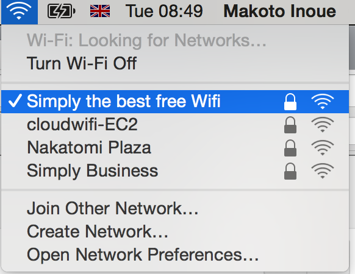
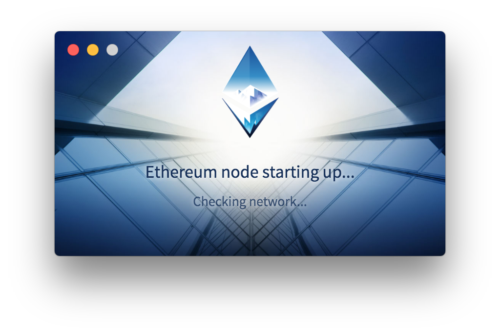
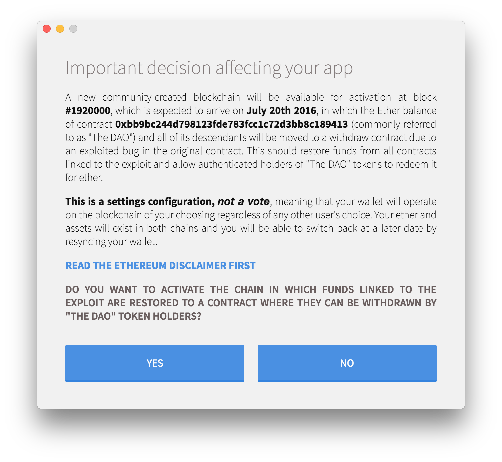
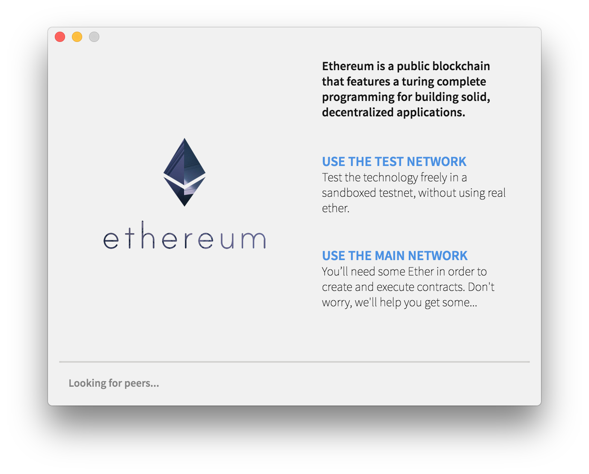
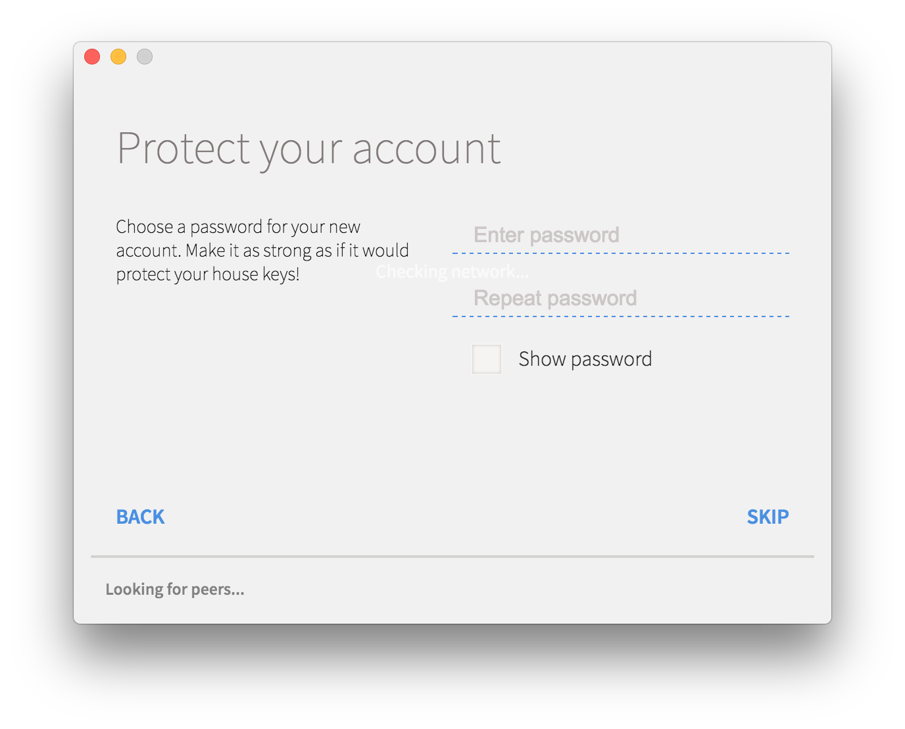
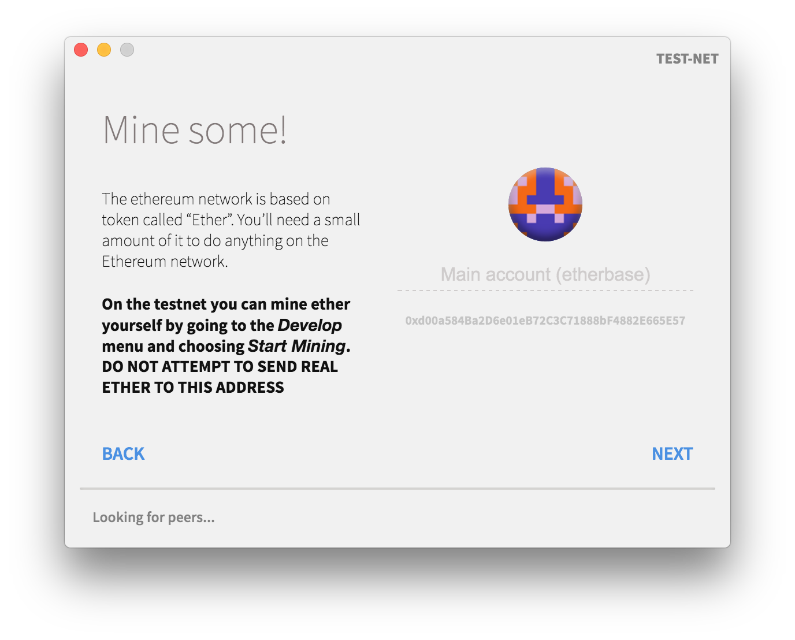
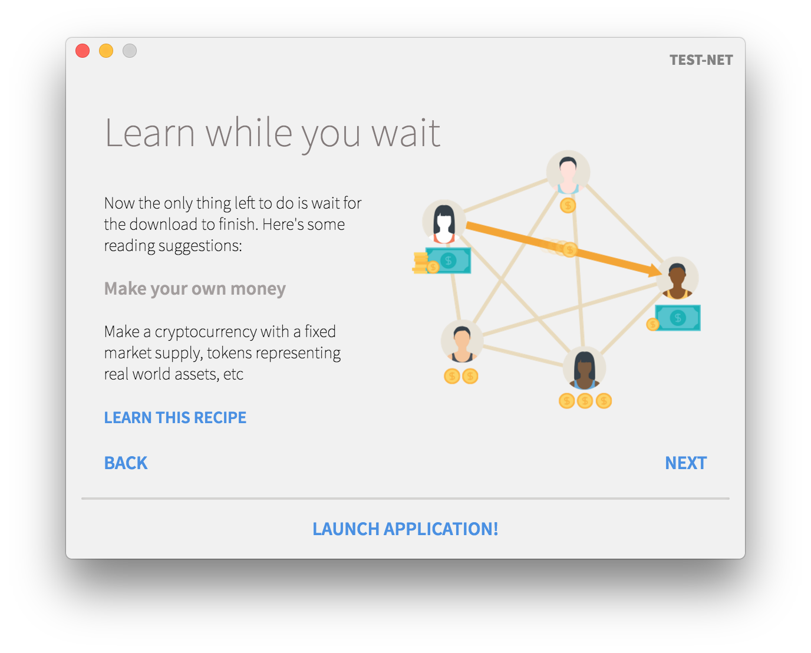
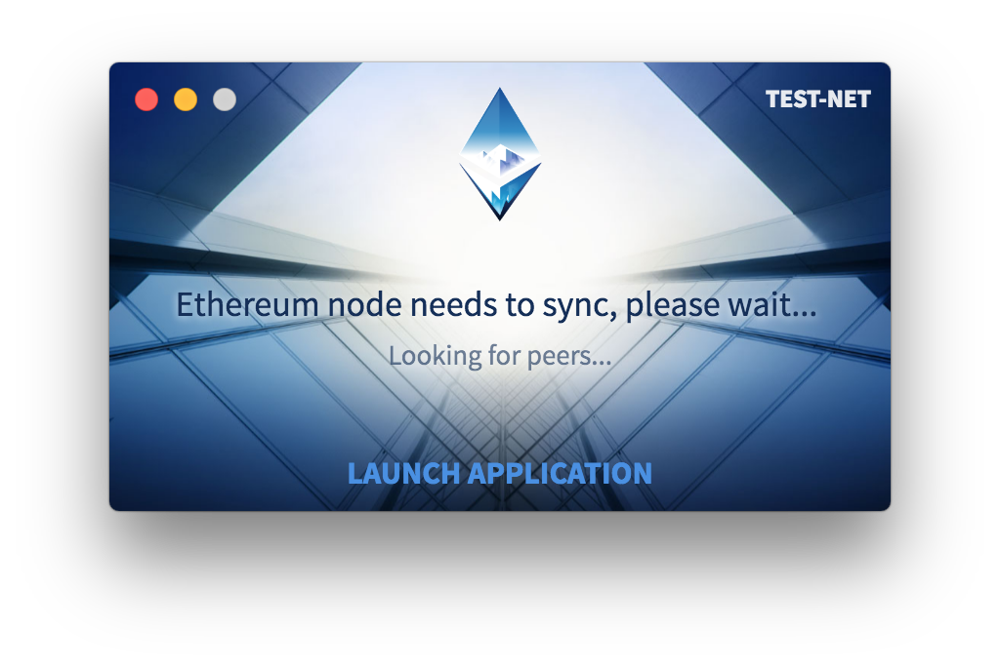
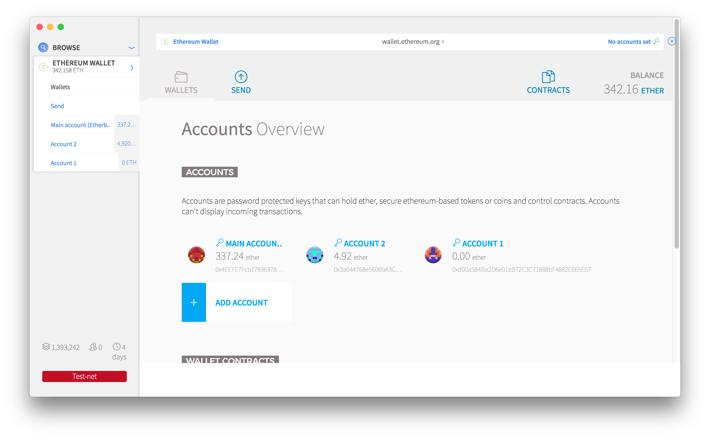
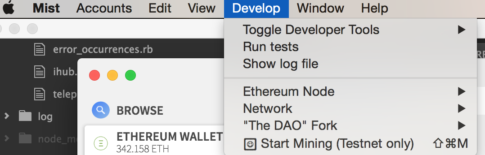

# How to setup Mist Browser

## Download

Please download program depending on your OS.

-[Mac](https://github.com/ethereum/mist/releases/download/0.8.1/Mist-macosx-0-8-1.zip)
-[Windows](https://github.com/ethereum/mist/releases/download/0.8.1/Mist-win64-0-8-1.zip)

## Make sure you are on "Simply The Best Free Wifi"

## Install the program and open it.

## Click yes

## Chose `TEST NETWORK`

## Create new account

## Click `NEXT`

## Click `LAUNCH APPLICATION`

## Click `LAUNCH APPLICATION`

NOTE: This phase may take more than a few hours. Be patient.

## MIST browser

## Start mining

After waiting 10~30 min, you will start earning Ether (Cryptocurrency on top of Ethereum blockchain)

